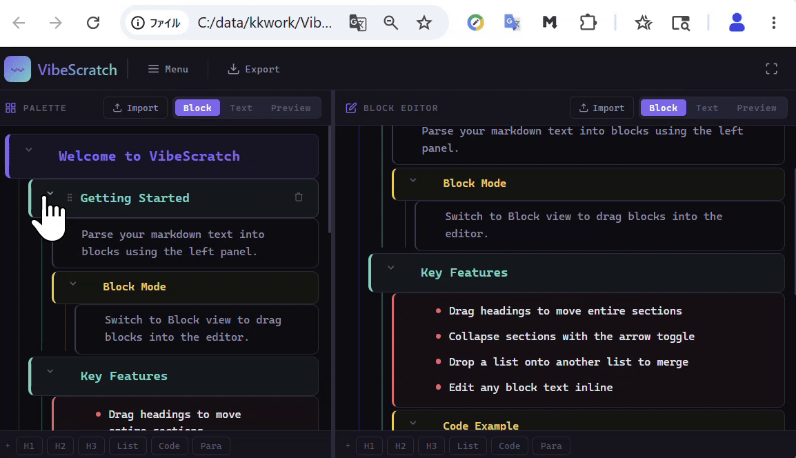

# VibeScratch

## Overview

VibeScratch is a single-file web app for editing Markdown as draggable blocks.

## Quick Start

Open the demo page in a web browser:

https://covao.github.io/VibeScratch/vibescratch.html

You can also download `vibescratch.html` and open it directly in a modern web browser.

## Features

* Single HTML file web app
* Markdown text import from `.md` and `.txt` files
* Block-based Markdown editing
* Left palette and right editor layout
* Drag and drop blocks from the palette to the editor
* Drag headings to copy or move a whole section
* Collapse and expand heading sections
* Edit block text inline
* Add heading, list, code, and paragraph blocks
* Reorder list items by drag and drop
* Merge list blocks by dropping one list onto another list
* Switch between Block, Text, and Preview modes
* Export the editor content as a Markdown file
* Resizable panels, sidebar menu, and fullscreen mode

## Requirements

* A modern web browser
* JavaScript enabled
* Recommended: latest Chrome, Edge, Firefox, or Safari

## Usage

Open `vibescratch.html` in a browser. The left panel is the block palette. You can write or import Markdown text there, then switch to Block mode to create draggable blocks.

Drag blocks from the left panel to the right editor. Heading blocks can include their child sections, so you can move a whole section as one group. In the right editor, you can edit text inline, reorder blocks, switch to Text mode for raw Markdown editing, or switch to Preview mode to check the rendered result.

Use the Export button to save the right editor content as a Markdown file.

## Reference

* HTML: The structure of the single-file web app
* CSS: The layout, dark theme, panels, blocks, and responsive styles
* JavaScript: Markdown parsing, block editing, drag and drop, import, preview, and export
* Markdown: The text format used for import, editing, preview, and export

## License

Add your project license here.
